# MZmine的简单教程  

本文件旨在介绍如何通过MZmine软件实现对mzML文件的**处理**与结果的**导出**  

## 基础介绍  

MZmine页面介绍：  
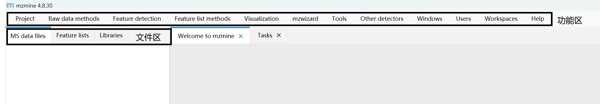  
我将MZmine分为两个区域：功能区与文件区  

### 功能区  

功能区包括了所有对文件的操作，包括但不限于引入文件、保存项目、对文件的处理以及导出等
> 会在后面的操作步骤中依次介绍  

### 文件区  

文件区分为`MS data files` 、`feature lists` 和`Library`三个区域  

- MS data files: 导入的原始质谱数据文件（如 mzML、mzXML 格式），包含所有扫描点的全谱信息、保留时间、强度等原始信号  
- Feature lists: 从原始数据中提取出的“特征”列表。**是由对原始文件的操作产生的**。每个特征代表一个假设的化合物离子，包含其 m/z、保留时间、峰面积/强度（用于定量）及关联的 MS/MS 谱图。  
- Library : ​用于化合物鉴定的参考数据库，包含已知化合物的质谱图、保留时间等信息。  

## 操作流程  

> 该操作流程将主要包含mzML文件导入(import)->质量检测(Mass Detection)->色谱图构建(ADAP Chromatogram builder)
> ->特征解卷积(Chromatogram deconvolution)->同位素峰分组与过滤(13C Isotope filter)->峰对齐(Peak Alignment)->间隙填充(Gap filling)
> ->结果导出(Export)。  

------  

>以下均以THC-80ppm.mzML文件为例  

### 文件的导入(import)以及项目保存  

文件引入：
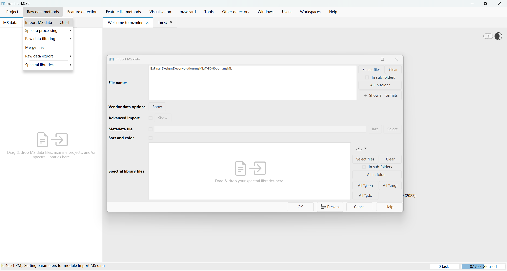  
由Raw data methods -> Import MS data 弹出的上方窗口中向MS data files 引入mzML文件(可批量引入)，下方窗口则用来向Library区域引入文件。  

引入完成后在MS data file 区域应当有所引入的文件  
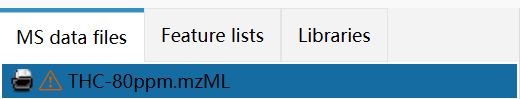  

项目保存：MZmine**不会自动保存**项目，也不会在退出时进行项目保存的提醒，如果不是处理后无需保存也没有下次查看的需求，保存项目需要自己留心。
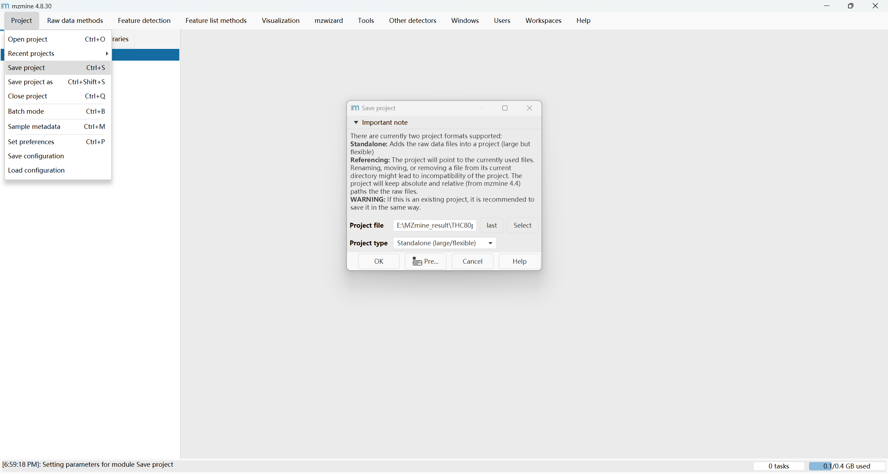  

- 通过弹出的页面选择项目保存地址与名称(Project File)
- 通过Project type 选择项目的保存方式 standalone（打开项目较快，因为数据已集成。但会占用大量磁盘空间）
  referencing(打开项目时需要重新链接并读取原始数据，可能稍慢。但节省磁盘空间)  

保存以后就可以在下次打开之后通过Project->Open Project打开上次保存的项目并接着保存的进度工作。  

### 质量检测(Mass Detection)  

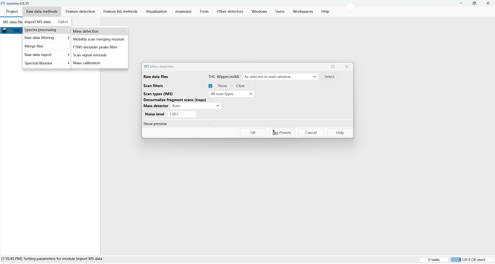  
在弹出的页面选择需要进行质量检测的文件  
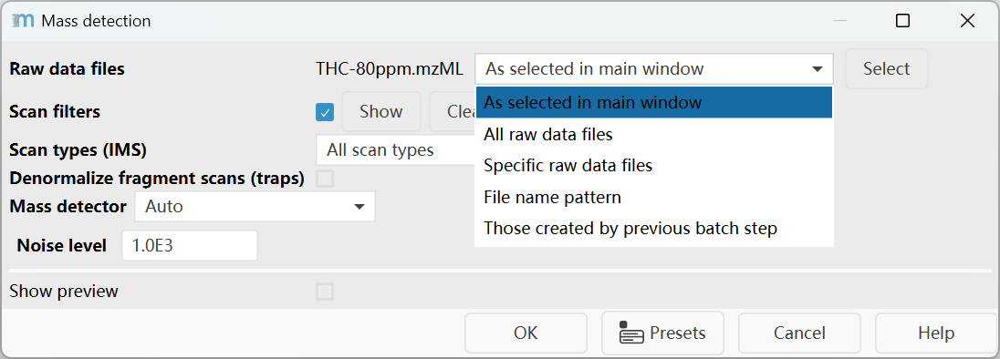

> 以后所有的文件选择都是这个操作，不做赘述。

- As selected in main window:手动在主窗口的MS数据文件列表中勾选  
- All raw data files:自动选择项目中**所有**已导入的原始数据文件
- Specific raw data files:通过文件浏览器手动指定磁盘上的具体文件
- File name pattern:使用通配符*等规则按文件名模糊匹配
- Those created by previous batch step:将上一个步骤的输出文件作为本步骤输入  

关键参数：

- 核心算法 (Mass detector):决定如何从原始信号中识别峰。选择高度依赖于数据是轮廓图（Profile）还是棒状图（Centroided）。
 常用建议：~~有auto用auto~~
  - Centroid: 已中心化数据
  - Exact Mass: 高分辨率轮廓数据
  - Wavelet Transform: 噪声较多的数据

- 噪声水平 (Noise level):区分真实信号与背景噪声的强度阈值。低于此阈值的信号将被过滤掉。
- 扫描过滤 (Scans):选择要处理的扫描范围，可基于保留时间（RT）、移动性（Mobility）或MS级别进行过滤。  

### 色谱图构建(ADAP Chromatogram builder)  

它的主要任务是为每个在连续扫描中出现的特定质量离子构建其提取离子色谱图（EIC）  
这个过程是整个非靶向分析的基础，因为它将原始数据转换成了一个个具体的“特征”（Features），每个特征都包含三个关键信息：精确的质荷比（m/z，用于定性）、保留时间（RT，辅助定性）和峰面积/高度（用于在不同样本间定量比较）。  
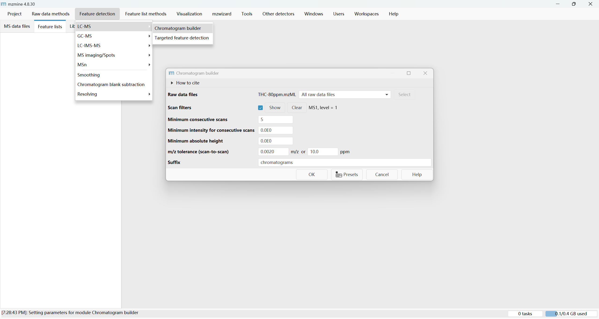  
在Feature Detection中选择质谱的类型(例如我的文件来自液相质谱，故选择LC-MS)，后进行ADAP Chromatogram builder，在弹出的窗口输入参数  

- Minimum consecutive scans（最小连续扫描数）：构成一个可信色谱峰所需的最小连续扫描次数。例如设置为3，则一个m/z信号必须在连续3次扫描中都出现，才会被识别为一个峰。
  设置过高：可能漏掉峰形窄、扫描点少的真实化合物峰。
  设置过低：容易将随机噪声误判为真实峰，引入假阳性信号。
- Minimum intensity for consecutive scans（连续扫描的最小强度）：在连续扫描中，信号强度必须达到的最低阈值。只有高于此阈值的信号点才会被计入“最小连续扫描数”。
  设置过高：可能漏掉低丰度化合物的弱信号。
  设置过低：难以将高强度信号峰与背景噪声区分开，导致峰形断裂。
- Minimum absolute height（最小绝对高度）：整个色谱峰的最高点必须达到的绝对强度值。这是一个硬性门槛，用于过滤掉信号太弱的峰。
  设置过高：会过滤掉大量低丰度但有分析价值的化合物。
  设置过低：会保留过多噪声峰，增加后续分析的复杂度和误差。
- m/z tolerance (scan-to-scan)（m/z容差）：在连续扫描中，将离子信号归为同一色谱峰所允许的质荷比最大偏差。通常用ppm（百万分之一）或绝对值（如0.001 Da）表示。
  设置过大：可能导致不同但质量接近的离子被错误合并。
  设置过小：可能使同一化合物的色谱峰因微小质量漂移而断裂。
- Suffix（后缀）：处理完成后，新生成的数据集名称后面添加的标识符。例如，原始数据叫“THC-80ppm”，后缀设置为“Chromatograms”，则新数据集名为“THC-80ppm Chromatograms”。
  主要是为了项目管理清晰，避免混淆原始数据和处理后的数据。  

>后缀在之后的处理过程中也会出现，以后就不再赘述了。
处理完成后就会生成FeatureList 中的第一个文件`THC-80ppm Chromatograms`
>在后续的处理中也会出现更多feature list中的文件，也不做过多叙述。
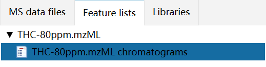  

在Feature List的文件中即可依靠右键的选项打开质谱图像  
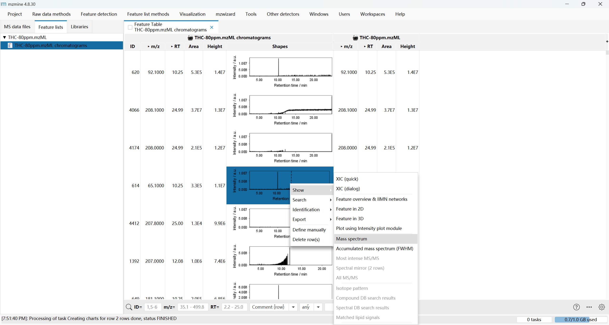  

### 特征解卷积(Chromatogram deconvolution)

在Feature Detection → Resolving中选择需要的解卷积算法：
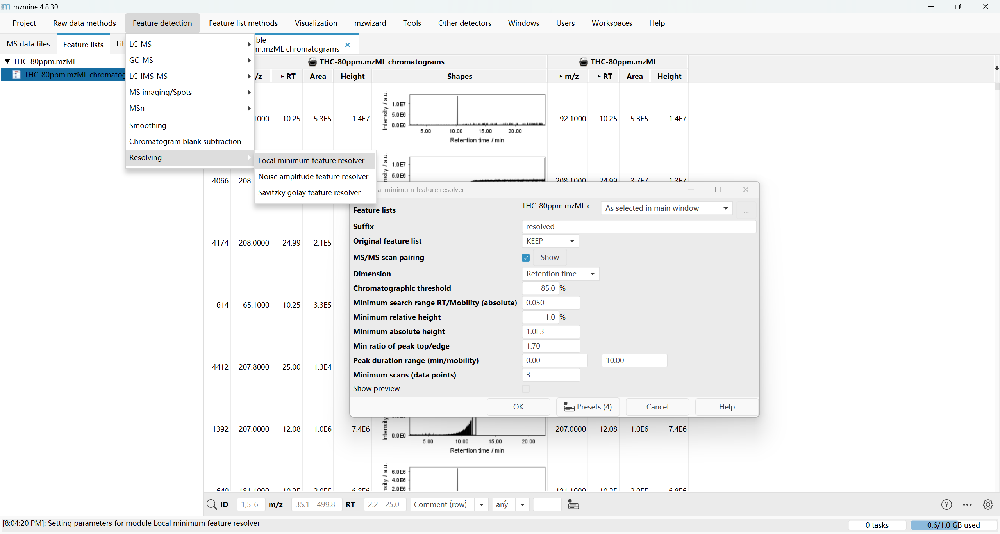

- Local Minimum Resolver：识别色谱图中的局部最小值点来分割重叠峰
  适用于数据质量较好、色谱峰形规整的常规LC-MS或GC-MS数据分析。
- Noise Amplitude Feature Resolver： 基于信噪比（SNR）阈值来识别和分离噪声与真实信号。
  适用于数据中存在明显异常振幅噪声（如地震数据中的突发性干扰）需要压制
- Savitzky-Golay Feature Resolver：利用多项式拟合对色谱数据进行平滑和求导，精确识别峰顶点和边界
  适用于数据噪声较大，且需要保持原始峰形特征进行精确定量分析。

解卷积的参数设置：

- MS/MS scan pairing​:确保二级质谱（MS/MS）与正确的一级特征（Feature）关联
- Dimension​:定在哪个分离维度上（如保留时间RT、离子淌度Mobility）进行解卷积
- Chromatographic threshold​:定义寻找峰谷（分离点）的搜索范围大小
- Minimum search range RT/Mobility (absolute)​:设置解卷积时在RT或Mobility维度上的最小搜索距离
- Minimum relative height​:设定判断峰谷的最低相对高度阈值（相对于最高峰）
- Minimum absolute height​:设定判断峰谷的最低绝对强度阈值
- Min ratio of peak top/edge​:帮助区分“平头峰”与真实共洗脱峰
- Peak duration range​:根据预期峰宽，过滤掉不合理的噪声信号
- Minimum scans (data points)​:规定形成一个可信峰所需的最少扫描次数（数据点）

### 同位素峰分组与过滤(13C Isotope filter)

在feature list methods ->isotope 中选择去同位素方式：

- 13C isotope filter (formerly: isotope grouper)：过滤与简化：从特征列表中识别并移除由¹³C等同位素产生的冗余特征。
- Isotopic peaks finder：发现与分组：在原始质谱数据中寻找并建立完整的同位素模式，将同位素峰归为一组。
- Isotope peak scanner：定向搜索：根据给定的化学式，在整个原始数据中扫描搜索其特定的同位素分布模式。

  
关键参数：  

- m/z tolerance (intra-sample)：设定在同一个样本内，将离子信号归为同一色谱峰所允许的质荷比最大偏差。
- Retention time tolerance：设定在不同样本间进行峰对齐时，将特征归为同一化合物所允许的保留时间最大偏差。
- Mobility tolerance：设定在离子淌度维度上，将特征归为同一化合物所允许的淌度值（如漂移时间或逆淌度）最大偏差。
- Monotonic shape：一个筛选条件，用于检查色谱峰的形状是否单调（先连续上升，后连续下降）。
- Maximum charge：设定在同位素峰分组时，考虑一个化合物可能带有的最大电荷数。
- Representative isotope：设定在特征对齐时，选择哪个同位素峰来代表整个同位素峰组进行跨样本匹配。
- Never remove feature with MS2：​一个重要的保护性选项，确保带有MS2谱图的特征在过滤步骤中不会被删除。

### 峰对齐(Peak Alignment)  

在Feature list methods​ → Alignment中选择峰对齐的方式

- Join aligner：基于设定的容差（如m/z、保留时间），将多个样本中的特征直接归并到一张综合表格中。
  适用于常规LC-MS或GC-MS数据的标准对齐方法，适用于样本数量不多、数据质量较好的情况。
- Merge lists：将多个特征列表简单合并为一个，不进行跨样本的特征匹配与整合。
  适用于将技术重复样本合并，或在对齐前将不同电离模式（正/负离子）下检测到的特征预先整合。
- RANSAC aligner：使用RANSAC算法稳健地拟合保留时间与离子淌度等偏差模型，能有效排除异常值的干扰。
  适用于样本数量多、保留时间漂移严重或数据中存在较多异常匹配的情况，对齐结果更可靠。
- GC aligner：专为气相色谱-质谱数据优化，重点考虑GC数据保留时间重复性较好、峰形较窄的特点。
  适用于处理GC-MS数据，尤其是当保留时间漂移较小时。
- LC-Image Aligner：专门用于液相色谱-成像质谱数据，校正样本间因样品制备或仪器波动导致的二维空间偏差。
  处理LC-IMS-MS数据，特别是来自成像实验，需要校正三维信息（保留时间、离子淌度、空间坐标）的数据。

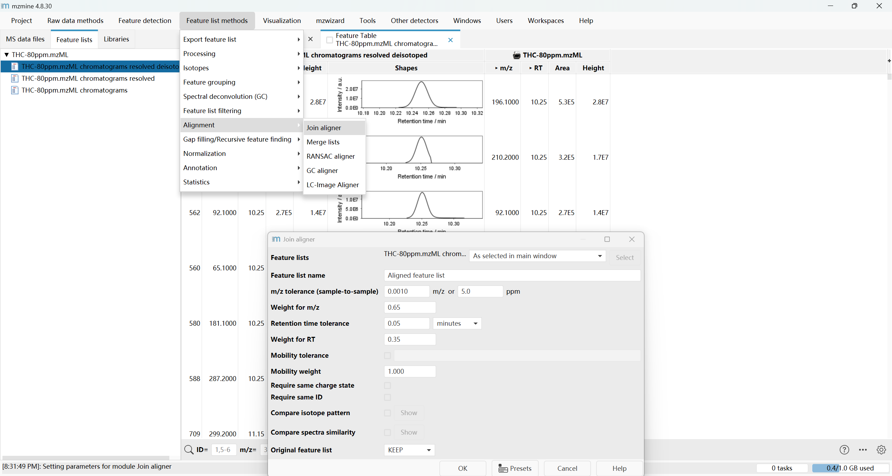

参数介绍：

- m/z tolerance (sample-to-sample)：设定不同样本中，两个特征的质荷比（m/z）允许的最大偏差。
- Weight for m/z：设定m/z的相似度在对齐综合评分中所占的权重或重要性。
- Retention time tolerance：设定不同样本中，两个特征的保留时间（RT）允许的最大偏差。
- Weight for RT：设定保留时间的相似度在对齐综合评分中所占的权重。
- Mobility tolerance：设定不同样本中，两个特征的离子淌度（Mobility）允许的最大偏差。
- Mobility weight：设定离子淌度的相似度在对齐综合评分中所占的权重。
- Require same charge state：要求只有带相同电荷数的特征才能被对齐在一起。
- Require same ID：要求只有具有相同化合物标识（ID）的特征才能被对齐在一起。
- Compare isotope pattern：在最终评分中，加入同位素分布模式的相似性比较。
- Compare spectra similarity：在最终评分中，加入MS/MS质谱图相似性的比较。

### 间隙填充(Gap filling)(可选)

在Feature list methods​ → Gap filling中选择间隙填充算法：

- Feature finder (multithreaded)：特征检测：从原始质谱信号中识别并积分出真实的色谱峰，生成“特征”。
- Same RT and m/z range gap filler：间隙填充：在已对齐的特征表中，寻找并补全在某些样本中未被成功检测到的特征信号。

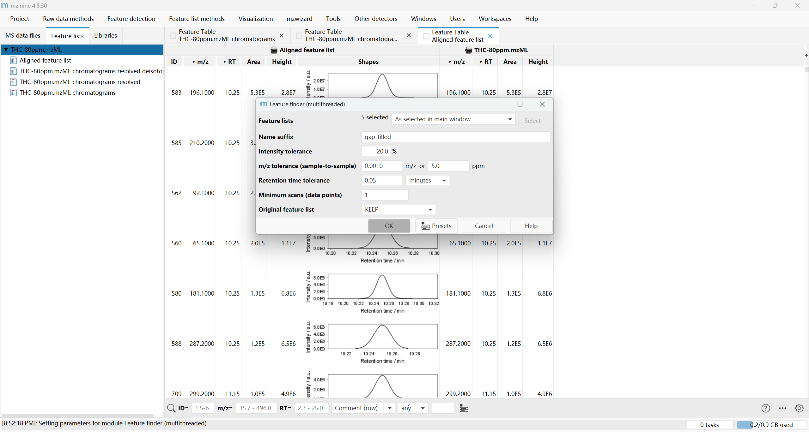

关键参数设定：

- Intensity tolerance:允许填充的峰强度与参考峰强度之间的相对变化范围，用于判断信号是否“足够显著”以进行填充。
- m/z tolerance (sample-to-sample):在不同样本间匹配同一特征时，允许的质荷比最大偏差。这是确保正确填充的关键。
- Retention time tolerance:在不同样本间匹配同一特征时，允许的保留时间最大偏差。
- Minimum scans (data points):形成一个可信的色谱峰所需的最少连续扫描次数（数据点数量）。

### 结果导出(Export)  

根据自己的需要在Feature list methods→ Export Method Lists 中选择导出的方式及文件格式  
> 这里我需要的是csv文件，故重点解释三种csv引出方式的不同  

- Export to CSV file (modular)：模块化、灵活性高。允许用户自定义选择需要导出的数据列（如峰面积、m/z、RT等），生成最适合下游分析的数据表。
  包含用户自定义选择的特征数据和测量值。
- Export all annotations to CSV file：专注于化合物鉴定结果。除了基本的特征信息，会包含详细的注释信息，如化合物名称、使用的数据库、匹配得分、碎片离子证据等。
  包含特征的基本信息 + 详细的化合物注释和鉴定置信度结果。
- Export CSV (legacy MZmine 2)：保证向后兼容性。采用MZmine 2时期的固定数据格式，确保导出的文件能被旧版流程或依赖该格式的脚本正确读取。
  特征的基本信息，格式与旧版MZmine 2保持一致。

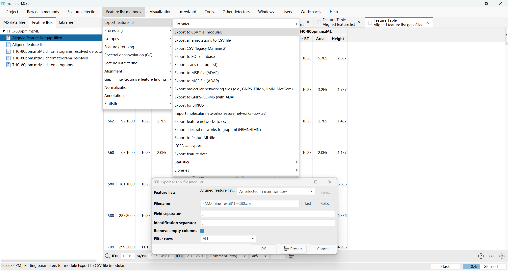

关键参数：

- Field separator：定义导出文件（如CSV）中不同列之间的分隔符号。
- Identification separator：当一个特征有多个鉴定结果时，定义这些结果在同一单元格内的分隔符号。
- Remove empty columns：一个**是/否**的选项，用于自动清理导出表格中完全没有数据的列。
- Filter rows：一个**是/否**的选项，用于在导出前根据预设条件从特征列表中移除整行数据。
  
------  

到这里，这个mzML文件的基础处理教程就结束了。
  